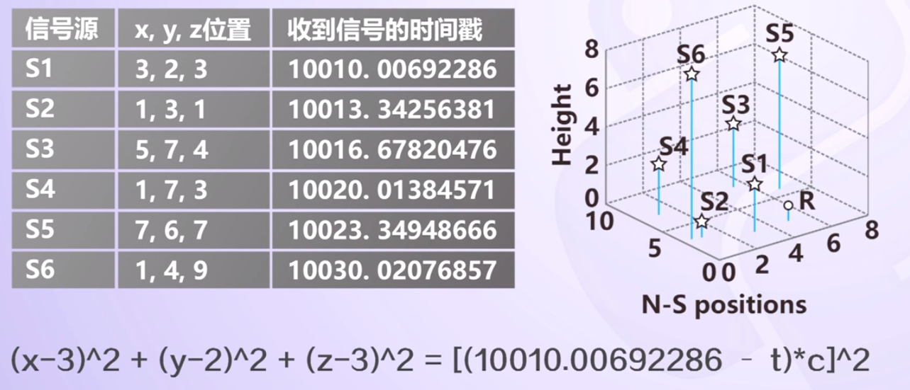
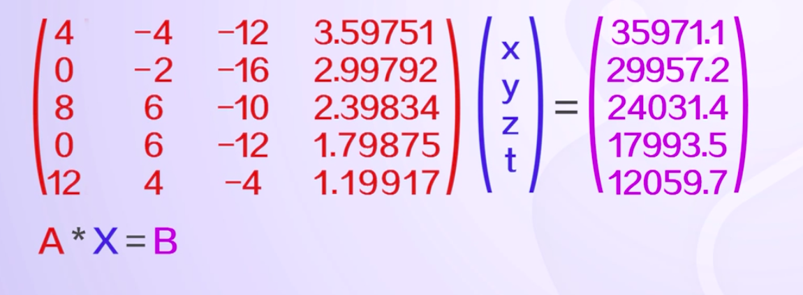

## GPS定位的基本原理

- 根据高速运动卫星的瞬间位置作为已知的起算数据。
- 采用**空间距离 - 后方交会**的方法，确定待测点的位置。

假设t时刻在地面待测点上安装GPS接收机，可以测定GPS信号到达接收机的时间差△t，再加上接收机接收到到卫星星历等其它数据，就可以确定一个方程组来对位置信息进行求解。

例如：假设地球上一个点R，同时接收6个卫星(S1, S2, ..., S6)

`x经度, y维度，z高度`.
`光速常量：c = 0.299792458km/us`

信号传输距离: `[(10010.00692286 - t) * c]^2`

根据二次方程简化得到线性关系： `A * X = B`

