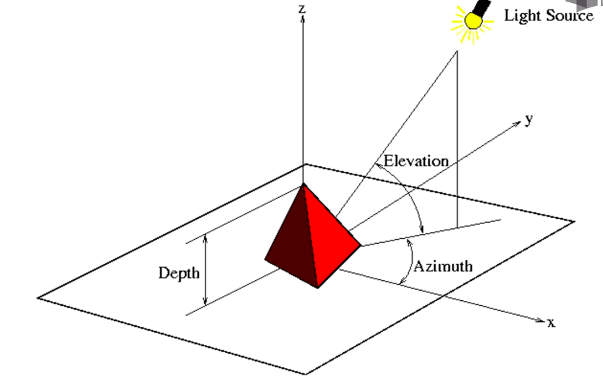

## 图像的RGB色彩模式

图像一般使用RGB色彩模式，即每个像素点的颜色由红R，绿G，蓝B组成。

RGB三个颜色通道之间的变化和叠加得到各种颜色，其中：
R红色，取值范围，0～255。
G绿色，取值范围，0～255。
B蓝色，取值范围，0～255。
总共叠加起来可以取：256^3种颜色。

RGB形成的颜色包括人类的视力所能感知的所有颜色。

> PIL库

PIL库是一个具有强大图像处理能力的第三方库。

安装：
```
pip install pillow
```
-----
```python
from PIL import Image
```
`Image`是PIL库中基础类，代表一个图像的类(对象)

> 图像的数组表示

计算机中，图片如何表示呢？
图像是一个由像素组成的二维矩阵，每个元素是一个RGB值。

```python
from PIL import Image
import numpy as np
import sys
import os

im = np.asarray(Image.open(os.path.join(sys.path[0], 'timg.jpg')))

print(im.shape, im.dtype) # (800, 1200, 3) uint8
# 图像是一个三维数组，维度分别是高度，宽度和像素RGB值。
```

> 图像变换

读入图像，获得像素RGB值，修改后保存为新的文件。

```python
from PIL import Image
import numpy as np

a = np.array(Image.open(''))
# 三维数组，值分别对应RGB的值。
print(a.shape, a.dtype)

b = [255, 255, 255] - a

im = Image.fromarray(b.astype('uint8'))
im.save('')
```

1. 打开图像。
2. 对RGB的值进行运算。
3. 运算后的数组，生成一个图像类型。
4. 保存文件。

```python
from PIL import Image
import numpy as np
import os
import sys

dirname = sys.path[0]

a = np.array(Image.open(os.path.join(dirname, 'timg.jpg')))
aa = np.array(Image.open(os.path.join(dirname, 'timg.jpg')).convert('L')) # convert() 将彩色的图片转换为灰度图片。
# aa 是二维数组，数值对应的是灰度值，而非RGB值。

b = [255, 255, 255] - a
c = 255 - aa # 灰度值取反
d = (100 / 255) * aa + 150 # 区间变换, a 乘 100 后除以，当前灰度值做一个区间压缩，再 加上150，扩充区间范围。
e = 255 * (aa / 255) ** 2  # 像素的平方

imb = Image.fromarray(b.astype('uint8'))
imb.save(os.path.join(dirname, 'timgb.jpg'))

imc = Image.fromarray(c.astype('uint8'))
imc.save(os.path.join(dirname, 'timgc.jpg'))

imd = Image.fromarray(d.astype('uint8'))
imd.save(os.path.join(dirname, 'timgd.jpg'))

ime = Image.fromarray(e.astype('uint8'))
ime.save(os.path.join(dirname, 'timge.jpg'))
```

## 手绘效果

1. 梯度重构
2. 光源效果
3. 梯度归一化
4. 图像生成

手绘效果特征：
- 黑白灰色系
- 边界线条较重
- 相同或相近色彩趋于白色
- 略有光源(明暗五调子)


梯度重构（核心原理）：
利用像素之间的梯度值和虚拟深度值对图像进行重构。
根据灰度变化来模拟人类视觉的明暗程度。

把图像看成二维离散函数，灰度梯度其实就是这个二维离散函数的求导，用差分代替微分，求取图像的灰度梯度。

```python
depth = 10. # 预设深度值为10， 取值范围0-100
grad = np.gradient(a) # 提取图片的梯度值
grad_x, grad_y = grad # 根据x和y方向的梯度值

grad_x = grad_x * depth / 100
grad_y = grad_y * depth / 100 # 根据深度调整x和y方向的梯度值
```
`np.gradient(a)`计算数组a中元素的梯度，f为多维时，返回每个维度的梯度。
当为二维数组时，np.gradient(a) 得出两个数组，第一个数组对应最外层维度的梯度，第二个数组对应第二层维度的梯度。

根据灰度变化来模拟人类视觉的远近程度:
- 设计一个位于图像斜上方的虚拟光源。
- 光源相对于图像的俯视角为Elevation, 方位角为Azimuth。
- 建立光源对于梯度值的影响函数。
- 运算出各点的新像素值。

光源效果：


```python
vec_el = np.pi / 2.2
vec_az = np.pi / 4.

dx = np.cos(vec_el) * np.cos(vec_az) # np.cos(vec_el)为单位光线，在地平面上的投影长度
dy = np.cos(vec_el) * np.sin(vec_az)
dz = np.sin(vec_el) # dx, dy, dz是光源对x,y,z三方向的影响程度
```

梯度归一化：
```python
A = np.sqrt(grad_x ** 2 + grad_y ** 2 + 1.) # 构造x和y轴梯度的三维归一化单位坐标系
uni_x = grad_x / A
uni_y = grad_y / A
uni_z = 1. / A

b = 255 * (dx * uni_x + dy * uni_y + dz * uni_z) # 梯度与光源相互作用，将梯度转化为灰度
```

图像生成：
```python
b = b.clip(0, 255) # 为避免数据越界，将生成的灰度值裁剪至0~255区间

im = Image.fromarray(b.astype('uint8'))
im.save('')
```

-----
```python
from PIL import Image
import numpy as np
 
a = np.asarray(Image.open('./beijing.jpg').convert('L')).astype('float')
 
depth = 10.                      # (0-100)
grad = np.gradient(a)             # 取图像灰度的梯度值
grad_x, grad_y = grad               # 分别取横纵图像梯度值
grad_x = grad_x*depth/100.
grad_y = grad_y*depth/100.
A = np.sqrt(grad_x**2 + grad_y**2 + 1.)
uni_x = grad_x/A
uni_y = grad_y/A
uni_z = 1./A
 
vec_el = np.pi/2.2                   # 光源的俯视角度，弧度值
vec_az = np.pi/4.                    # 光源的方位角度，弧度值
dx = np.cos(vec_el)*np.cos(vec_az)   # 光源对x 轴的影响
dy = np.cos(vec_el)*np.sin(vec_az)   # 光源对y 轴的影响
dz = np.sin(vec_el)              # 光源对z 轴的影响
 
b = 255*(dx*uni_x + dy*uni_y + dz*uni_z)     # 光源归一化
b = b.clip(0,255)
 
im = Image.fromarray(b.astype('uint8'))  # 重构图像
im.save('./beijingHD.jpg')
```
