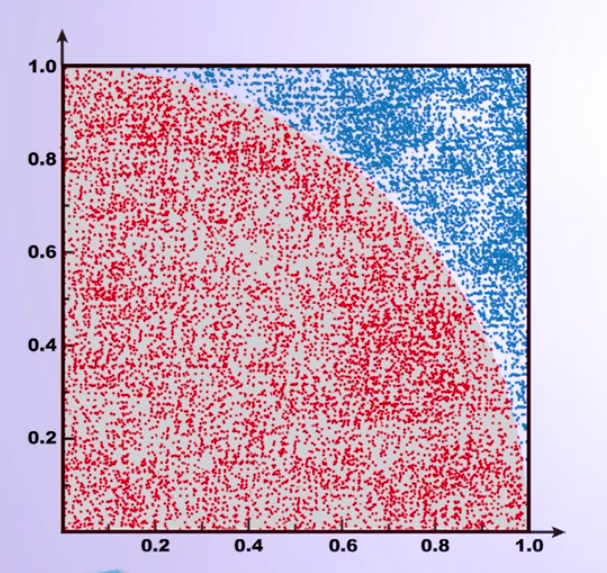

## PI值计算

- 圆周率π是一个无理数，没有任何一个精确的公式能够计算π值，π的计算只能采用“近似算法”。
- 国际公认的π值计算采用“蒙特卡洛方法”。
- “蒙特卡洛方法”又称之为”随机抽样“或统计试验方法。当所求解的问题是某种事件出现的概率，或某种随机变量的期望值时，可以通过某种“试验”的方法来求解。
    简单说，蒙特卡洛方法是利用**随机试验求解问题**的方法。


1. 构造一个单位正方形，和四分之一圆
2. 随机向圆结构抛洒大量的点。对于每个点，可能在圆内，可能在圆外。当随机抛洒点达到一定程度时，圆内的点构成圆的面积。
3. 使用圆内的点的数量 除以 整个点的数量。就是面积比，即 π/4。随机点越大，得到的π值越精确。



π计算问题的IPO：
- 输入：抛入点的数量。
- 处理：对于每个抛洒点，计算点到圆心的距离，通过距离判断该点在圆内或圆外。统计在圆内的点的数量。
- 输出: π的值。

```python
from random import random
import math
import time

DARTR = 2000000 # 抛洒点越多越精确。
hits = 0

time.clock()

for i in range(1, DARTR): # 循环抛洒点
    x, y = random(), random()
    dist = math.sqrt(x**2 + y**2) # 计算点之间的距离
    if dist <= 1.0:
        hits = hits + 1

pi = 4 * (hits / DARTR) # π/4

print('pi：%s' % pi)
print('run time: %-5.5ss' % time.clock())
```